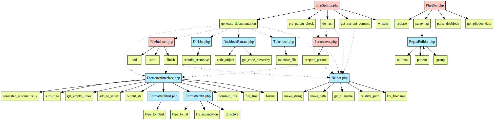
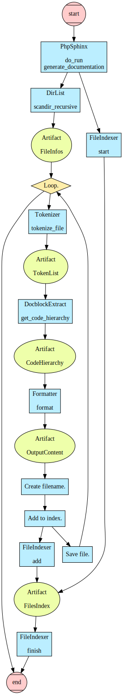

Technical guide
===============

The actual workflow of the application is in the method :php:meth:`TMD\\Documentation\\PhpSphinx::generate_documentation`.

1. Find all PHP files and with each file:

   a. **Tokenize file**
   b. Transform to **code hierarchy**
   c. Remember names of namespaces encountered in the file
   d. **Format code hierarchy** with selected formatter
   e. Add file to index

2. Save index files and for root index, add references to namespace indexes.

:php:class:`TMD\\Documentation\\PhpSphinx` brings the functionality together and acts as application interface.

